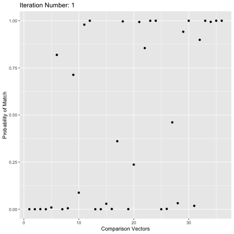

```{r, include = FALSE}
knitr::opts_chunk$set(
  collapse = TRUE,
  comment = "#>"
)
```

```{r setup,echo = F, message = FALSE}
library(fastLink)
library(lubridate)
library(RecordLinkUtil)
library(knitr)
library(dplyr)
library(stringdist)

```


## The Entity Matching Problem:
Given two datasets without shared unique identifers, how can we determine which records represent the same real world "entity"?

Example: Matching health insurance claims and death certificates in maine over the last 5 years.

## The Entity Matching Problem: 
We can generate claims and death certificate data that reflects this situation:

```{r}


#Start and end dates for death certificate data
start_date = ymd("2015-1-1")
start_date_num = as.numeric(start_date)
end_date = ymd("2019-1-3")
end_date_num = as.numeric(end_date)

data_size = 1000
data <- tibble(id = 1:data_size,
                   town = sample_towns_by_pop(data_size), 
                   birthyear = sample(data_size, x = 1960:2000, replace = TRUE),
                   sex = sample(data_size, x = c("M", "F"), replace = TRUE),
                   deathdate = as_date(sample(data_size, x = start_date_num:end_date_num, replace = TRUE)))

dth_crt = data[1:500,]

kable(dth_crt[1:10,])


claims <-  mutate(dth_crt,
                          birthyear = corrupt_numeric(birthyear, error_rate = .3, scale = 1),
                          town = corrupt_replace(town, pool = dth_crt$town),
                          town = corrupt_character(town),
                          deathdate = as_date(corrupt_numeric(as.numeric(deathdate), error_rate = .9,  scale = 10)))
                    
kable(claims[1:10,])
look = cbind(data, claims)
kable(look[1:10,])
```

## The Entity Matching Problem: Naive Aproach
Joining exactly on all fields yeilds very few matches:
```{r}
perfect_matches = inner_join(dth_crt, claims, by = c("town", "birthyear", "sex", "deathdate"))
print(paste0("Only ", nrow(perfect_matches), " perfect matches out of ", nrow(dth_crt)))
```
## The Entity Matching Problem: fastLink
The fastLink solution:
```{r, echo = F,message=F}
claims <- mutate(claims, deathdate = as.numeric(deathdate), birthyear = as.numeric(birthyear))
dth_crt <- mutate(dth_crt, deathdate = as.numeric(deathdate), birthyear = as.numeric(birthyear))
```

```{r}
result <- fastLink(claims, dth_crt, 
                   varnames = c("town", "birthyear", "sex", "deathdate"),
                   numeric.match = c("birthyear", "deathdate"),
                   stringdist.match = c("town"),
                   partial.match = c("town", "deathdate"),
                   cut.a.num = 1, cut.p.num = 14,
                   cut.a = .94, cut.p = .88,
                   threshold.match = .85)

print(paste0("Result returns an object of class: ", class(result)))
print(paste0(" with fields: ", paste( names(result), collapse = ", ")))

```
------

##Fellegi-Sunter Model of Record Linkage:
A formalization and general algorithm for record linkage.

1. Calculating the __comparison vector__ for each pair of records
2. Finding the probability of any given comparison vector given a match/nonmatch.
3. Assigning the weights to each comparison vector & finding matches

##1. Calculating Comparison vectors:

-Comparison Vector: a formal respresentation of the differencebetween two records
-Usually in terms of the numeric "distances" between each feild being matched on

##Comparison vectors Example 1:
```{r, include = FALSE}

get_comp_vec <- function(a, b){
  out <- list()
  town_dist <- 1 - stringdist(a$town, b$town, method = "jw")
  yob_dist <- abs(a$birthyear - b$birthyear)
  sex_dist<- as.numeric(!(a$sex == b$sex))
  deathdate_dist <- abs(as.numeric(a$deathdate)- as.numeric(b$deathdate))
  return(tibble("town_dist" = town_dist, "yob_dist" =yob_dist, "sex_dist" =sex_dist, "deathdate_dist" = deathdate_dist))
}

```


```{r,echo = FALSE}
record_1 <- dth_crt[1,]
print("The first record in the dth_crt data is :")
kable(record_1)
print("The first record in the claims data is :")
record_2 <- claims[1,]
kable(record_2)
print("The second record in the claims data is :")
record_3 <- claims[2,]
kable(record_3)

print("The comparison vector between the first records of the claims and crt data is:")
kable(get_comp_vec(record_1,record_2))

print("The comparison vector between the first record of the claims and the second record of crt data is:")
kable(get_comp_vec(record_1,record_3))
```
##Comparison vectors Example 2:
```{r,echo = FALSE}
record_1 <- dth_crt[1,]
print("The first record in the dth_crt data is :")
kable(record_1)
print("The second record in the claims data is :")
record_3 <- claims[2,]
kable(record_3)

print("The comparison vector between the first record of the claims and the second record of crt data is:")
kable(get_comp_vec(record_1,record_3))
```


This is a natural way of creating comparison vectors, but it has several subtle probabilistic issues.
If we eventually want find the probability of a comparison vector occuring between a match/nonmatch (step 2 of fellegi-sunter), how can we allow a continous variable like string distance from a potentially continous probability space without making the probability of any one given comparison vector zero?

The way fastLink and most other open source packages navigate this is by assigning discrete cutoffs for each metric that paritions the range of possible distances given by that metric into three similarity levels: very similar, similar, and completly different. These three scores are encoded as integers 2, 1, and 0 respectivly.

In our example, we can assign cutoffs 2, 10 for numeric metrics, .02, .15 for string distances, and for exact matching on gender, we'll just assign a score very similar if they match, and completly different if they dont. This means if we have a numeric distance between 0 and 2, we call it very similar, between 2 and 10 similar, and over 10 completly different.

Given these cutoffs, our previous comparison vectors become:
```{r, echo = FALSE}
cv1 <-  get_comp_vec(record_1,record_2)
cv2 <- get_comp_vec(record_1,record_3)

cvs <- rbind(cv1, cv2)

cvs <-  mutate(cvs,
               town_dist = ifelse(town_dist >= .98, 2, ifelse(town_dist >= .8 , 1, 0)),
               yob_dist = ifelse(yob_dist <= 2, 2, ifelse(yob_dist <= 10 , 1, 0)),
               deathdate_dist = ifelse(deathdate_dist <= 2, 2, ifelse(deathdate_dist <= 10,1, 0)),
               sex_dist = ifelse(sex_dist == 0, 2, 0))
               

print("The comparison vector between the first records of the claims and crt data is:")
kable(cvs[1,])

print("The comparison vector between the first record of the claims and the second record of crt data is:")
kable(cvs[2,])
```

These comparison vectors are identical what fastLink uses under the hood. In the fastLink documentation and in this vignette, we will refer to the comparison vector of records $i$ and $j$ of the first and second data base as $\gamma_{i,j}$.

##2. Finding probabilities:
Once we have the comparison vector for every pair, we can start estimating several probabilities:

1. $P(M_{i,j})$: The probability of any two records $i$, $j$ being a true match(ie represent the same real world entity).  

2. $P(\gamma_{i,j} |M_{i,j})$: The probability that comparison vector $\gamma_{i,j}$ occuring given records $i$ and $j$ are a true match.

3. $P(\gamma_{i,j} |\neg M_{i,j})$:The probability that comparison vector $\gamma_{i,j}$ occuring given records $i$ and $j$ are not a true match.

We want to estimate $P(M_{i,j})$,  $P(\gamma_{i,j} |M_{i,j})$, and $P(\gamma_{i,j} |\neg M_{i,j})$, because using bayes rule we can then calculate the probability of $i$, $j$ being a match given the observed comparison vector $\gamma_{i,j}$.

$$
P( M_{i,j}|\gamma_{i,j}) = \frac{P( \gamma_{i,j}|M_{i,j})P(M_{i,j})}{P( \gamma_{i,j}|M_{i,j})P(M_{i,j}) + P( \gamma_{i,j}|\neg M_{i,j})P(\neg M_{i,j})}
$$
To estimate these probabilities, fastLink uses an unsupervised learning technique called the expectation-maximization algorithm. 

###EM Algorithm

The EM algorithm assumes that there is latent and observed data drawn from some distribution $f(x|\theta)$, which is a function of some unknown parameters $\theta$. We want to find the values of the parameter $theta$ which maximizes the probability of the observed data occuring. The probability of fixed observed data $x$ as a function of the unknown parameters $\theta$ is usually called the "likelihood function", and this process of finding the parameters that maximize this is called likelihood maximization. 

The EM algorithm works by first making a (educated) guess for values for the parameters, then iterativly improving this guess by finding the probabilities of the observed data for all possible values of the latent data given the current values of the parameters, then updating the parameters to better suit the calculated probabilities.

In this application, the observed data are the comparison vectors for every pair of records, the latent data is whether every pair is a match or not, and two sets of parameters 

1.$\pi_{kml}$: The probabilities that for any given feild k in the comparison vector, the probability of that feild taking on the lth similarity level, given a match or a nonmatch. In our ongoing example, the parameter $\pi_{2,1,2}$ would represent the probability that the year of birth(k = 2) between two matched records(m = 1) is within 1 year of each other(l = 2).

2.$\lambda$ The probability that any two pairs are a match (ie just $P(M_{i,j})$)

Assuming that the parameters are conditionally independent given a match/nonmatch, we can the calculate $P(\gamma_{i,j} |M_{i,j})$ for comparison vector $\gamma_{i,j} = \langle a_1, a_2, ..., a_k \rangle$ as a product of parameters $P(\gamma_{i,j} |M_{i,j}) = \pi_{1,1,a_1}*\pi_{2,1,a_2}* \dots \pi_{k,1,a_k}$

In our example, we would calculate the probability of this comparison vector given a match $P(\gamma_{1,1} |M_{1,1})$
```{r, echo = FALSE}
print("The comparison vector between the first records of the claims and crt data is:")
kable(cvs[1,])
vec <- cvs[1,]
pi_vec <- vector(mode = "character", length = length(vec))

for(i in 1:length(vec)){
  pi_vec[i] = paste0("pi_",i,"1",vec[i])
}
print(paste("P(gamma_{1,1} |M_{1,1})", pi_vec, collapse = " * "))
```
Using these parameters, we can calulate the probability $i,j$ are a match given the observed comparison vector:
$$
P( M_{i,j}|\gamma_{i,j}) = \frac{(\pi_{1,1,a_1}*\pi_{2,1,a_2}* \dots *\pi_{k,1,a_k})\lambda}{(\pi_{1,1,a_1}*\pi_{2,1,a_2}* \dots *\pi_{k,1,a_k})\lambda + (\pi_{1,0,a_1}*\pi_{2,0,a_2}* \dots *\pi_{k,0,a_k})(1-\lambda)}
$$
We can then update $\lambda$ to be the expected value of the number of matches  over the total number of pairs, given the number of records in dataframes A and B is $N_a$ and $N_b$ respectivly, and the number of true matches is $N_m$:

$$
\lambda = \frac{E[N_m]}{N_a*N_b} = \frac{\sum_{i = 1}^{N_a}\sum_{j = 1}^{N_b}P( M_{i,j}|\gamma_{i,j})}{N_a*N_b}
$$
We can also update each $\pi_{kml}$ to be the expected number of matches/nonmatches in pairs of records with agreement level $l$ in the kth feild, over the expected number of matches/nonmatches, where $S_l$ is the set of all pairs $(i,j)$ s.t the $k$th feild of the comparison vector $\gamma_{i,j}$ is $l$, and $N_{lm}$,$N_{lu}$ is the number of matches/non-matches in $S_l$.
This means that given a match(m = 1), $\pi_{k1l}$ is updated as:
$$
\pi_{k1l} = \frac{E[N_{lm}]}{E[N_m]} = \frac{\sum_{(i,j)\in S_l}P( M_{i,j}|\gamma_{i,j})}{\sum_{i = 1}^{N_a}\sum_{j = 1}^{N_b}P( M_{i,j}|\gamma_{i,j})}
$$
And given a nonmatch(m = 0), $\pi_{k0l}$ is updated as:
$$
\pi_{k0l} = \frac{E[N_{lu}]}{E[N_u]} = \frac{\sum_{(i,j)\in S_l}(1-P( M_{i,j}|\gamma_{i,j}))}{\sum_{i = 1}^{N_a}\sum_{j = 1}^{N_b}(1-P( M_{i,j}|\gamma_{i,j}))}
$$
These values can be thought of as how associated a given similarity level in the kth feild is with a match/nonmatch. 

This back and forth between calculating the probabilities $P( M_{i,j}|\gamma_{i,j})$ given the paramaters (the expectation step) and updating the the parameters based on the probabilities ($P( M_{i,j}|\gamma_{i,j})$) will eventually converge to a local maximum, as the parameter space is bounded(each probability is between 0 and 1) and each iteration provides updated parameters with a greater likelihood than the old parameters.

The only issue is that the algorithm may converge to a local maximum that is nowhere near the true maximum, which we combat by making our starting guess such that for every feild $k$, and similarity levels $i$ and $l$ s.t. $i < l$, then $\pi_{k1i} << \pi_{k1l}$ and $\pi_{k0l} << \pi_{k0i}$. IE, feilds with higher similarity levels are more likely to occur given a match than a nonmatch, and vice versa.

###Visualizing The EM Algorithm

We can get a better inutitive understanding of this algorithm using the folowing animation. Each animation plots elements of the EM algorithm as performed on data generated in the same way as our example, with numeric matching on birthyear and deathdate, string matching on townname, exact matching on sex, and patial matching on townname and deathdate.




Figure 1 is the probability that a comparison vector represents a match given the comparison vector $P( M_{i,j}|\gamma_{i,j})$ on the y axis, and a index representing every unique observed comparison vector $\gamma_{i,j}$ along the x axis. The probabilities start unstable, but eventually converge.

##3. Assigning Weights & Finding Matches

Now, once the EM algorithm converges, we have our estimates for $P( M_{i,j}|\gamma_{i,j})$. However, fastLink does not match on $P( M_{i,j}|\gamma_{i,j})$ alone, but instead on the fellegi-sunter weight of $(i,j)$, which are defined:

$$

w_{i,j} = \log(\frac{P(\gamma_{i,j} |M_{i,j})}{P(\gamma_{i,j} |\neg M_{i,j})})

$$

In the actual code, these weights are translated by $-\log(\frac{\sum_{(v\in V)} P(\gamma_{v} |M_{v})}{\sum_{(v\in V)} P(\gamma_{v} |M_{v}))$, but the translation dosen't effect the  linkage rule. The way matches are determined is by selecting a probability threshold for $P(M_{i,j}|\gamma_{i,j})$, then any pair $(i,j)$ with weight $w_{ij}$ greater that the weight of the comparison vector with least posterior  probability $P(M_{i,j}|\gamma_{i,j})$ over the given threshold.

The probability threshold can be thought as a bound for the false detection rate, where increasing the threshould decreases the FDR. Given the threshold $p_t$, the false detection rate can be estimated $FDR \leq (1-p_t)$, but in reality this is not often the case. That is why I've found it helpful to assign the probability threshold after looking at the $P( M_{i,j}|\gamma_{i,j})$ for each comparison vector above the cutoff.

#The fastLink function

Most of fastLinks user interface consists of the single wrapper function fastLink(). To get a feeling of how it works, we'll use it on the test data that we generated. Unfortunatly, fastLink currently only supports partial matching(having more than one agreement level) for numeric and character values, so we'll have to cast everything we want to compare numerically to numeric(including the dates).

```{r}
claims <- mutate(claims, deathdate = as.numeric(deathdate), birthyear = as.numeric(birthyear))
dth_crt <- mutate(dth_crt, deathdate = as.numeric(deathdate), birthyear = as.numeric(birthyear))

result <- fastLink(claims, dth_crt, 
                   varnames = c("town", "birthyear", "sex", "deathdate"),
                   numeric.match = c("birthyear", "deathdate"),
                   stringdist.match = c("town"),
                   partial.match = c("town", "deathdate"),
                   cut.a.num = 1, cut.p.num = 14,
                   cut.a = .94, cut.p = .88,
                   threshold.match = .85)
```
This is the basic structure of a call to fastLink: we provide the two dataframes we want to match, the column names of the data we want to match on(the names must be the same in both dataframes), then how we want to compare each column. As previously stated, fastLink only supports non-exact comparisons with numeric and character columns, so all other columns will be compared exactly, with similarity level 2 if the same, and 0 if different. We can specify the numeric and character columns we want to compare non-exactly using numeric.match and stringdist.match, which will instead use cutoffs to determine their similarity levels.

fastLink also only allows one or two cutoffs, so every field will either have two or three similarity levels: 0,2, or 0,1,2. By default every field is matched with only 2 similarity levels, but we can specify which columns we want to use 3 similarity levels on by name using partial.match. Note that the names in partial.match must be in either numeric.match or stringdist.match

We can also apply our own cutoffs using cut.a.num, cut.p.num for numeric comparisons and cut.a, cut.p for string comparisons.

Here, we are matching on variables town, birthyear, sex, and deathdate. We specify that birthyear and deathdate are to be matched using the numeric cutoffs, town name will be matched using sting distance cutoffs, but only town name and death date will use both cutoffs. Lets apply this to a example


```{r, echo = F}
r1 <- tibble(town = "PORTLAND", birthyear = 1988, deathdate = 16500, sex = "M")

print("Record 1:")
kable(r1)
r2 <- tibble(town = "ORTLAND", birthyear = 1989, deathdate = 16501, sex = "M")
print("Record 2:")
kable(r2)
r3 <- tibble(town = "RTLAND", birthyear = 1990, deathdate = 16514, sex = "F")
print("Record 3:")
kable(r3)
apply_cutoffs <- function(x, cut.a, cut.p, cut.num.a, cut.num.p){
  res <- tibble(town_dist = ifelse(x$town_dist >= (cut.a), 2, ifelse(x$town_dist >= (cut.p),1,0)),
                yob_dist = ifelse(x$yob_dist <= (cut.num.a), 2, 0),
                deathdate_dist = ifelse(x$deathdate_dist <= cut.num.a, 2, ifelse(x$deathdate_dist <= cut.num.p,1,0)),
                sex_dist = ifelse( x$sex_dist == 0,2, 0)
                )
  return(res)
}

print("Comparison Vector between Record 1 and Record 2")
comp_vec1 <- get_comp_vec(r1,r2)
comp_vec1 <- apply_cutoffs(comp_vec1, cut.a = .94, cut.p = .88, cut.num.a = 1, cut.num.p = 14)
kable(comp_vec1)

print("Comparison Vector between Record 1 and Record 3")
comp_vec2 <- get_comp_vec(r1,r3)
comp_vec2 <- apply_cutoffs(comp_vec2, cut.a = .94, cut.p = .88, cut.num.a = 1, cut.num.p = 14)
kable(comp_vec2)
```

This call to fastLink returns a bunch of information bundled into a FastLink object:

Firstly, and most importantly, it returns the detected matches as a 2 column matrix of indices into the first and second data frames. Because we have the real indices of each match, we can find the sensitivity and specificity of the matching:

```{r}
matches <- result$matches
kable(matches[1:10,])
print(paste0("Number of detected matches: ",nrow(matches)))
c_table <- getConfusion(claims, dth_crt, matches, "id")
kable(c_table)
c_table_info <- getConfusionInfo(c_table)
kable(c_table_info)
```
It also returns "posteriors" and "patterns", which is the corrisponding probability of a match and comparison vector for every pair in matches. 
```{r}
posterior <- result$posterior
patterns <- result$patterns
kable(posterior[1:10])
kable(patterns[1:10,])
matched_pairs <- cbind(claims[matches[,1],],dth_crt[matches[,2],],posterior)
matched_pairs <- bindMatches_p(claims[-1], dth_crt[-1], posterior, matches, idA = "claims.", idB = "dth_crt.")
kable(matched_pairs[1:10,])
```
Finally, the FastLink object also contains a EM object, which contains all the information about the EM algorithm, like the parameters that maximize the likelihood of the observed probability vectors, etc. Most of the information is not directly useful for interpretation, but a noteable exception is w.patterns and zeta.j. w.patterns and zeta.j are similar to the patterns and posterior contained in the fastLink object, but instead of a list of comparison vectors for every match, patterns.w only contains the unique comparison vectors, and zeta.j contains the probability for evey comparison vector in patterns.w. This allows us to see the comparison vectors included with
```{r}
EM <- result$EM
unique_patterns = cbind(as.data.frame(EM$patterns.w)[,-c(6,7,8)], EM$zeta.j)
unique_patterns <- unique_patterns[rev(order(EM$zeta.)),]
kable(unique_patterns)
```


```{r}
 new_cutoff <- unique_patterns[4,6]

new_result <- fastLink(claims, dth_crt, 
                   varnames = c("town", "birthyear", "sex", "deathdate"),
                   numeric.match = c("birthyear", "deathdate"),
                   stringdist.match = c("town"),
                   partial.match = c("town", "deathdate"),
                   cut.a.num = 1, cut.p.num = 14,
                   cut.a = .94, cut.p = .88,
                   threshold.match = new_cutoff)

print(paste0("Number of detected matches: ",nrow(new_result$matches)))
new_c_table <- getConfusion(claims, dth_crt, new_result$matches, "id")
new_c_table_info <- getConfusionInfo(new_c_table)
```

##Optional arguments to fastLink:

###dedupe.matches
Enforces that every record in dfA must match with at most one record in dfB. Does this by choosing the best match for every document in A and B, then breaks ties arbitrarily. Is true by default, when false returns every match over matching threshold.

###return.all
Sets the threshold for a match to 0. If dedupe.matches is also true, this will return the best matches for every record in the smaller dataframe. If dedupe matches is not true, it will return all pairs of records in dfA and dfB.

###cond.indep
The fellegi-sunter model for record linkage assumes conditional independence of feilds in comparison vectors, but this is sometimes not the case. If cond.indep is false, then we use a modified version of the fellegi-sunter model.

##Techniques for reducing computation time


